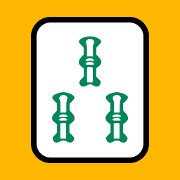

# Sanzou Tile Avatar Generator

[Live demo](https://torontoriichi.club/sanzou-generator)

A tool for customizing and downloading sanzou tile avatars.

## License

[MIT](./LICENSE)

Tile art based on the [logo of the Toronto Riichi Club](https://github.com/toronto-riichi-club/toronto-riichi-club.github.io/blob/master/assets/logos/logo.svg).

Sanzou markings based on tile art by [FluffyStuff](https://github.com/FluffyStuff/riichi-mahjong-tiles), licensed under the [Creative Commons Attribution 4.0 International License](http://creativecommons.org/licenses/by/4.0/).
